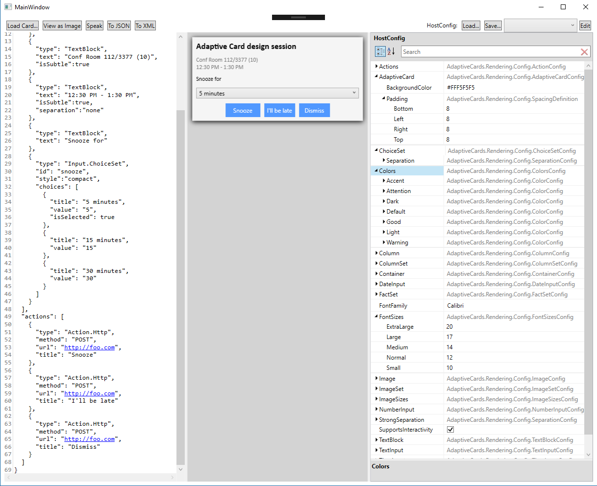

# .NET WPF SDK

As we described in [Getting Started](../GettingStarted.md) page, an Adaptive Card is a JSON-serialized card object model. To make it easy to manipulate the object model, you can use the .NET SDK to serialize to and from JSON.

> [!IMPORTANT]
> **Breaking changes from v0.5**
> 
> 1. Package renamed `AdaptiveCards.Rendering.Wpf`
> 1. Due to frequent name collisions with framework namespaces, all model types have been prefixed with "Adaptive". E.g., `TextBlock` is now `AdaptiveTextBlock`
> 1. There have also been some schema changes from the v0.5 preview, which are [outlined here](https://github.com/Microsoft/AdaptiveCards/pull/633)

## NuGet install

[](https://www.nuget.org/packages/AdaptiveCards.Rendering.Wpf)

```console
Install-Package AdaptiveCards.Rendering.Wpf -IncludePrerelease
```

## Xceed enhanced input package

This optional package adds enhanced Input controls beyond what WPF provides out of the box.

[](https://www.nuget.org/packages/AdaptiveCards.Rendering.Wpf.Xceed)

```console
Install-Package AdaptiveCards.Rendering.Wpf.Xceed -IncludePrerelease
```

## Render card

### Instantiate a renderer
Create an instance of the renderer library. 
```csharp
using AdaptiveCards;
using AdaptiveCards.Rendering;
using AdaptiveCards.Rendering.Wpf;
// ...

// Create a default renderer
AdaptiveCardRenderer renderer = new AdaptiveCardRenderer();

// If using the Xceed package, enable the enhanced input
renderer.UseXceedElementRenderers();

// For fun, check the schema version this renderer supports
AdaptiveSchemaVersion schemaVersion = renderer.SupportedSchemaVersion;
```


### Render the card into XAML

```csharp
// Build a simple card
// In the real world this would probably be provided as JSON
AdaptiveCard card = new AdaptiveCard()
                    {
                        Body = { new AdaptiveTextBlock() { Text = "Hello World" } }
                    };

// Render the card
RenderedAdaptiveCard renderedCard = renderer.RenderCard(card);

// Validate the rendered card
if (renderedCard.FrameworkElement == null)
{
    // Failed rendering
    return;
}

// Get the FrameworkElement
FrameworkElement el = renderedCard.FrameworkElement;

// Just for fun, get the AdaptiveCard object model back out
AdaptiveCard originatingCard = renderedCard.OriginatingCard;
```

### Wire up Action events

On your rendered card, use the `OnAction` event to subscribe to action invoked events.

```csharp

renderedCard.OnAction += MyActionHandler;

private void MyActionHandler(RenderedAdaptiveCard sender, ActionEventArgs e)
{
    // Handle Action.OpenUrl
    if (e.Action is AdaptiveOpenUrlAction openUrlAction)
    {
        Process.Start(openUrlAction.Url);
    }
    // Handle Action.ShowCard (if popup mode)
    else if (e.Action is AdaptiveShowCardAction showCardAction)
    {
        if (Renderer.HostConfig.Actions.ShowCard.ActionMode == ShowCardActionMode.Popup)
        {
            var dialog = new ShowCardWindow(showCardAction.Title, showCardAction, Resources);
            dialog.Owner = this;
            dialog.ShowDialog();
        }
    }
    // Handle Action.Submit (how do you want to submit cards?)
    else if (e.Action is AdaptiveSubmitAction submitAction)
    {
        var inputs = sender.GetUserInputs(InputValueMode.RawString).AsJson();
        inputs.Merge(submitAction.Data);
        MessageBox.Show(this, JsonConvert.SerializeObject(inputs, Formatting.Indented), "SubmitAction");
    }
}
```

### HostConfig

You should consider applying a Host Config to the renderer for basic styling and behavior support. 
```csharp

// Construct programmatically
renderer.HostConfig = new AdaptiveHostConfig() 
{
    FontSizes = {
        Small = 15,
        Default = 20,
        Medium = 25,
        Large = 30,
        ExtraLarge= 40
    }
};

// Or parse from JSON
AdaptiveHostConfigParseResult result = AdaptiveHostConfig.FromJson(@"{
    ""fontSizes"": {
        ""small"": 25,
        ""default"": 26,
        ""medium"": 27,
        ""large"": 28,
        ""extraLarge"": 29
    }
}");

if (result.HostConfig != null)
{
    renderer.HostConfig = result.HostConfig;
}
else
{
    // Error parsing
}
```

### Native platform styling

If you pass in a ResourceDictionary, you can customize the Xaml behavior further. This
allows you to define roll over behaviors, animations, rounded buttons, and so forth.  Here is a table of the 
style names that are used for each element.  

| Element | Style names used|
|---|---|
| AdaptiveCard | Adaptive.Card| 
| Action.OpenUrl  | Adaptive.Action.OpenUrl  |
| Action.ShowCard | Adaptive.Action.ShowCard |
| Action.Submit  | Adaptive.Action.Submit  |
| ActionSet | Adaptive.ActionSet |
| Column | Adaptive.Column, Adaptive.Action.Tap |
| ColumnSet | Adaptive.ColumnSet, Adaptive.VerticalSeparator |
| Container | Adaptive.Container|
| Input.ChoiceSet | Adaptive.Input.ChoiceSet,  Adaptive.Input.ChoiceSet.ComboBox, Adaptive.Input.ChoiceSet.CheckBox,  Adaptive.Input.ChoiceSet.Radio,  Adaptive.Input.ChoiceSet.ComboBoxItem, |
| Input.Date | Adaptive.Input.Text.Date
| Input.Number | Adaptive.Input.Text.Number |
| Input.Text | Adaptive.Input.Text |
| Input.Time | Adaptive.Input.Text.Time |
| Input.Toggle| Adaptive.Input.Toggle|
| Image  | Adaptive.Image |
| ImageSet  | Adaptive.ImageSet |
| FactSet | Adaptive.FactSet, Adaptive.Fact.Title, Adaptive.Fact.Value|
| TextBlock  | Adaptive.TextBlock |

Here is a sample resource dictionary which adds a hover effect on elements with an Action defined on them:
```xml
<Window.Resources>
    <Style x:Key="Adaptive.Action.Tap" TargetType="Button">
        <Style.Triggers>
            <Trigger Property="IsMouseOver" Value="True">
                <Setter Property="Cursor" Value="Hand" />
            </Trigger>
            <EventTrigger RoutedEvent="UIElement.MouseEnter">
                <BeginStoryboard>
                    <Storyboard>
                        <DoubleAnimation Duration="0:0:0.2" Storyboard.TargetProperty="Opacity" To="0.7" />
                    </Storyboard>
                </BeginStoryboard>
            </EventTrigger>
            <EventTrigger RoutedEvent="UIElement.MouseLeave">
                <BeginStoryboard>
                    <Storyboard>
                        <DoubleAnimation Duration="0:0:0.2" Storyboard.TargetProperty="Opacity" To="1.0" />
                    </Storyboard>
                </BeginStoryboard>
            </EventTrigger>

        </Style.Triggers>
        <Setter Property="Template">
            <Setter.Value>
                <ControlTemplate TargetType="Button">
                    <Border Background="Transparent">
                        <ContentPresenter/>
                    </Border>
                </ControlTemplate>
            </Setter.Value>
        </Setter>
    </Style>
</Window.Resources>
```

## Extensibility

### Change per-element rendering
The renderer has a registration mechanism which allows you to set a function that is called to perform the
rendering on a per-element basis.  It exposes a method called `ElementRenderers.Set<TElement>(func); `

To override the rendering of a `Input.Date` element:
```csharp
renderer.ElementRenderers.Set<DateInput>(MyCustomDateInputRenderer);
```

The new date renderer would look like this in WPF:
```csharp
public static FrameworkElement Render(DateInput input, RenderContext context)
{
    var datePicker = new DatePicker();
    ...
    return datePicker;
}
```

## WPF Visualizer Sample

The [WPF visualizer sample project](https://github.com/Microsoft/AdaptiveCards/tree/master/source/dotnet/Samples/WPFVisualizer) lets you visualize cards using WPF.  A `hostconfig` editor is built in for editing and viewing host config settings. Save these settings as a JSON to use them in rendering in your application.



