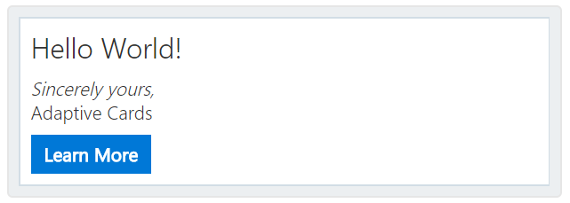

# Bot Developers

Adaptive Cards are a great fit for Bots. They let you author a card once and have it render beautifully inside multiple apps, like Skype\*, Microsoft Teams\*, your own website, and more.

> [!NOTE]
> Skype and Microsoft Teams are not yet supported in the current preview, but we're working on it! Please see the Channel Status section below for details.

## Try it out

Click the following link and [talk to our Scuba Bot](http://contososcubabot.azurewebsites.net/). Say `hello` and he'll help you book the scuba trip of your dreams.  

All of the bot's responses are created with Adaptive Cards.

[](http://contososcubabot.azurewebsites.net/)

# Adaptive Cards in Bot Framework

With the [Bot Framework](https://dev.botframework.com/) you can write a bot is able to chat with users across multiple "channels", like Skype, Microsoft Teams, Facebook Messenger, etc.

> [!IMPORTANT]
> ### Early Preview Disclaimer
> We're thrilled you want to try out Adaptive Cards! :raised_hands:
>
> ... but we want to take this opporunity to remind you that we're in preview and actively seeking feedback, so please expect a few rough edges and reach out with any feedback you may have. 

## Walkthrough

It's pretty straight forward to add an Adaptive Card to your bot.

### Step 0: Start with a basic message

Here's a standard Bot Framework `message` payload that can be delivered to any channel and display text to the user.

```json
{
   "type": "message",
   "text": "Plain text is ok, but sometimes I long for more..."
}
```

### Step 1: Add an Adaptive Card `attachment`

To add some richness beyond just text, the Bot Framework has a concept of `attachment`. Let's add an Adaptive Card `attachment` that displays custom text.



```json
{
  "type": "message",
  "text": "Plain text is ok, but sometimes I long for more...",
  "attachments": [
    {
      "contentType": "application/vnd.microsoft.card.adaptive",
      "content": {
        "type": "AdaptiveCard",
        "body": [
          {
            "type": "TextBlock",
            "text": "Hello World!",
            "size": "large"
          },
          {
            "type": "TextBlock",
            "text": "*Sincerely yours,*"
          },
          {
            "type": "TextBlock",
            "text": "Adaptive Cards",
            "separation": "none"
          }
        ],
        "actions": [
          {
            "type": "Action.OpenUrl",
            "url": "http://adaptivecards.io",
            "title": "Learn More"
          }
        ]
      }
    }
  ]
}
```

### Step 2: Build even richer cards 

Adaptive Cards offer more than just customizable text.

Some other things you can do with Adaptive Cards are...

* Add `Images` to your card
* Add structure to your content with `Containers` and `Columns`
* Add multiple types of `Actions`
* Collect `Input` from your users
* Have one card `show another card`
* ...[and more](http://localhost:55000/explorer/)! 


## Platform Libraries

If your bot is developed using .NET or NodeJS we have libraries to make building Adaptive Cards even easier.

Platform|Install|Learn more
--------|-------|----------
.NET | `Install-Package Microsoft.AdaptiveCards` | [Bot Framework .NET Docs](https://docs.microsoft.com/en-us/bot-framework/dotnet/bot-builder-dotnet-add-rich-card-attachments)
NodeJS | `npm install microsoft-adaptivecards` | [Bot Framework NodeJS Docs](https://docs.microsoft.com/en-us/bot-framework/nodejs/bot-builder-nodejs-send-rich-cards)


## Channel status

The Bot Framework let's you publish your bot to multiple channels. We're working with various channels to provide full support for Adaptive Cards. Below is the current list of channels and their status.

Channel | Status
--------|-------
[Emulator](https://docs.microsoft.com/en-us/bot-framework/debug-bots-emulator) | Full support
[WebChat Control](https://github.com/Microsoft/BotFramework-WebChat) | Full support
Skype | Full support coming soon
Microsoft Teams | Full support coming soon
Bing | Coming soon via Skype Webchat Control
Cortana | Full support coming
Kik | Render to Image + limited mapping to keyboard (full support coming)
Facebook Messenger | Render to image + limited mapping to  buttons
Slack | Render to Image + limited mapping to buttons
Telegram | Render to Image + limited mapping to keyboard
SMS | Render to Image + text
GroupMe | Render to Image + text
Email | Render to Image + limited mapping to links
Skype For Business | Not supported


# Dive in!

We've just scratched the surface in this tutorial, so please take a look at the links below to explore more ways that Adaptive Cards can enhance your bot.

* [Browse Sample cards](http://adaptivecards.io/samples/) for inspiration
* Use the [Schema Explorer](http://adaptivecards.io/explorer) to learn the available elements
* Build a card using the [Interactive Visualizer](http://adaptivecards.io/visualizer/index.html?hostApp=Skype)
* [Get in touch](http://adaptivecards.io/connect) with any feedback you have
