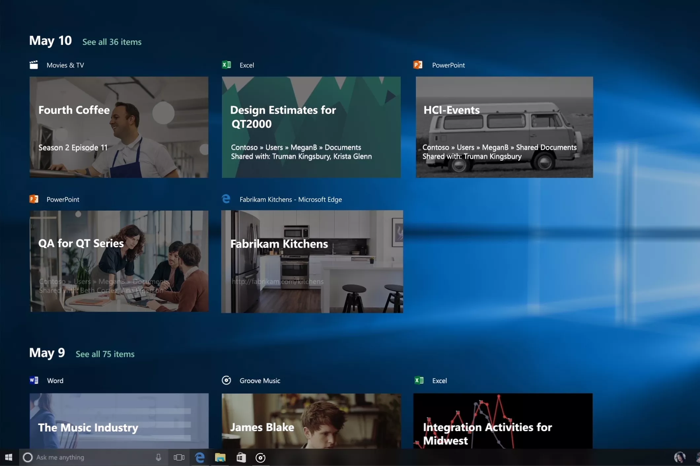

# Adaptive Cards for Windows Developers

> [!NOTE]
>
> We're thrilled you want to try out Adaptive Cards! :raised_hands:
>
> ... but we want to take this opportunity to remind you that **we're in preview and actively seeking feedback**, so please expect a few rough edges and reach out with any feedback you have. 

## Timeline

The first Windows experience to supports Adaptive Cards will be Timeline, a brand new experience coming in the next Windows release. 



### UserActivity API

> [!IMPORTANT]
>
> Timeline is not in current Windows builds (even Insider builds), so there's no way to view your Activities at this time. The following API is provided to highlight the proposed direction.

The [`Windows.ApplicationModel.UserActivities.UserActivity`](https://docs.microsoft.com/en-us/uwp/api/windows.applicationmodel.useractivities.useractivity) API is what populates an Activity into Timeline.

The Adaptive Card will be supplied via the `Content` property of `VisualElement`, as seen below:

```
UserActivity userActivity = await channel.GetOrCreateUserActivityAsync(activityId, new HostName("contoso.com"));
userActivity.ActivationUri = new Uri("rss-reader:article?" + article.Link);
userActivity.DisplayText = article.Title; //used for details tile text
userActivity.VisualElements.Content = AdaptiveCardBuilder.CreateAdaptiveCardFromJson(jsonString);
await userActivity.SaveAsync();
```

### Learn more

This session at Build 2017 covers User Activities in detial.

<iframe src="https://channel9.msdn.com/Events/Build/2017/B8108/player" width="960" height="540" allowFullScreen frameBorder="0"></iframe>

## Other Windows Surfaces
We don't have anything to share just yet, but we're working on incorporating Adaptive Cards into more Windows experiences.

## Dive in!

We've barely scratched the surface in this tutorial, so check back soon and browse the links below to explore more about Adaptive Cards.

* [Browse Sample cards](http://adaptivecards.io/samples/) for inspiration
* Use the [Schema Explorer](http://adaptivecards.io/explorer) to learn the available elements
* Build a card using the [Interactive Visualizer](http://adaptivecards.io/visualizer/index.html?hostApp=Skype)
* [Get in touch](http://adaptivecards.io/connect) with any feedback you have
