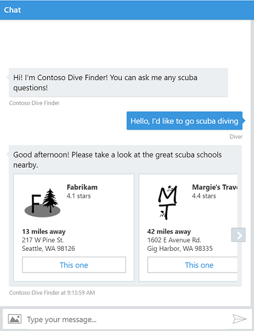

# Adaptive Cards for Bot Developers

Adaptive Cards are a great fit for Bots. They let you author a card once and have it render beautifully inside multiple apps, like  Microsoft Teams, your own website, and more.

> [!NOTE]
> Skype is not supported in the current preview. See the [Partner Status](../resources/partners.md) page for the latest.

## Try it out

Click the following link and [talk to our Scuba Bot](http://contososcubademo.azurewebsites.net/). Say `I'm looking for scuba` and it'll help you book the scuba trip of your dreams.  

All of the bot's responses are created with Adaptive Cards.

[](http://contososcubademo.azurewebsites.net/)

**Get the code**: the full [Contoso Scuba Bot source code](https://github.com/matthidinger/ContosoScubaBot
) can be found on GitHub.


## Bot Framework Integration

With the [Bot Framework](https://dev.botframework.com/) you can write a single bot that is able to chat with users across multiple "channels", like Skype, Microsoft Teams, Facebook Messenger, etc.

## Walkthrough

It's pretty straight forward to add an Adaptive Card to your bot.

### Step 0: Start with a basic message

Here's a standard Bot Framework `message` payload that can be delivered to any channel and display text to the user.

```json
{
   "type": "message",
   "text": "Plain text is ok, but sometimes I long for more..."
}
```

### Step 1: Add an Adaptive Card `attachment`

To add some richness beyond just text, the Bot Framework has a concept of `attachments`. 

Let's attach an Adaptive Card that displays custom text.


```json
{
  "type": "message",
  "text": "Plain text is ok, but sometimes I long for more...",
  "attachments": [
    {
      "contentType": "application/vnd.microsoft.card.adaptive",
      "content": {
        "type": "AdaptiveCard",
        "version": "1.0",
        "body": [
          {
            "type": "TextBlock",
            "text": "Hello World!",
            "size": "large"
          },
          {
            "type": "TextBlock",
            "text": "*Sincerely yours,*"
          },
          {
            "type": "TextBlock",
            "text": "Adaptive Cards",
            "separation": "none"
          }
        ],
        "actions": [
          {
            "type": "Action.OpenUrl",
            "url": "http://adaptivecards.io",
            "title": "Learn More"
          }
        ]
      }
    }
  ]
}
```

### Step 2: Build even richer cards 

Adaptive Cards offer much more than just customizable text. 

You can: 

* Add `Images` to your card
* Organize your content with `Containers` and `Columns`
* Add multiple types of `Actions`
* Collect `Input` from your users
* Have one card `show another card`
* [Check out the full schema explorer](http://adaptivecards.io/explorer/)! 

## Platform SDKs

If your bot is developed using .NET or NodeJS we have libraries to make building Adaptive Cards even easier.

Platform|Install|Learn more
--------|-------|----------
.NET | `Install-Package AdaptiveCards -IncludePrerelease` | [Bot Framework .NET Docs](https://docs.microsoft.com/en-us/bot-framework/dotnet/bot-builder-dotnet-add-rich-card-attachments)
NodeJS | `npm install adaptivecards` | [Bot Framework NodeJS Docs](https://docs.microsoft.com/en-us/bot-framework/nodejs/bot-builder-nodejs-send-rich-cards)


## Channel status

The Bot Framework lets you publish your bot to multiple channels. We're working with various channels to provide full support for Adaptive Cards. See the [Partner Status](../resources/partners.md) page for the latest.


## Dive in!

We've just scratched the surface in this tutorial, so please take a look at the links below to explore more ways that Adaptive Cards can enhance your bot.

* [Browse Sample cards](http://adaptivecards.io/samples/) for inspiration
* Use the [Schema Explorer](http://adaptivecards.io/explorer) to learn the available elements
* Build a card using the [Interactive Visualizer](http://adaptivecards.io/visualizer/index.html?hostApp=Skype)
* [Get in touch](http://adaptivecards.io/connect) with any feedback you have
