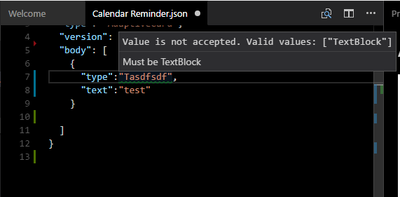
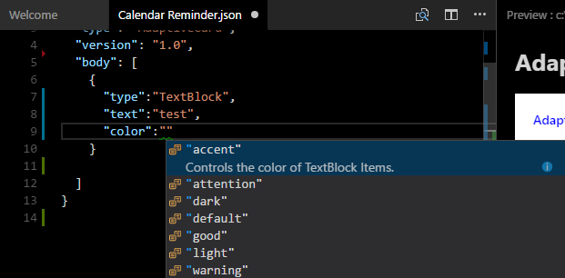
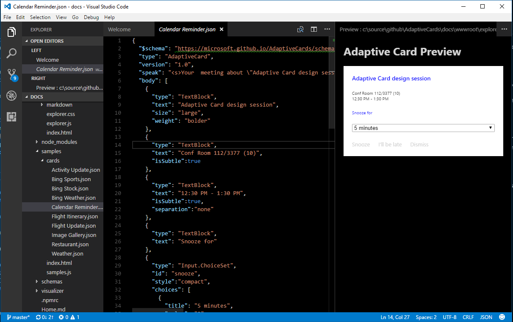
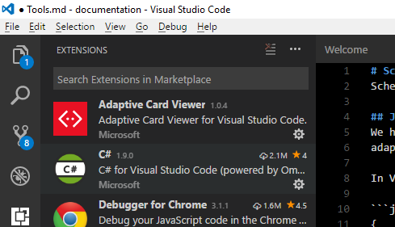

# Schema validation
Schema validation is a powerful way of making authoring easier and enabling tooling.

## JSON Schema
We have provided a complete [JSON Schema file](http://adaptivecards.io/schemas/adaptive-card.json) for editing and validating 
adaptive cards in json.

In Visual Studio and Visual Studio Code you can get automatic Intellisense by including a `$schema` reference.





### Example

```json
{
    "$schema": "http://adaptivecards.io/schemas/adaptive-card.json",
    "type": "AdaptiveCard",
    "version": "0.5",
    "body": []
}
```

# Tools and samples
There are some tools and samples in the source tree which are useful references as well as useful tools.

## Visual Studio Code Extension
We have created a Visual Studio code extension which allows you to visualize the card you are editing in real time
inside the editor itself. 



To install, open Extensions Marketplace and search for **Adaptive Card Viewer**.



### Usage

When you are editing a .json file with an Adaptive Card `$schema` property you can view by using `Ctrl+Shift+V A`.
```json
{
    "$schema": "http://adaptivecards.io/schemas/adaptive-card.json",
    "type": "AdaptiveCard",
    "version": "1.0",
    "body": []
}
```

### Options

The following Visual Studio Code setting is available for the AdaptiveCards Viewer. This can be set in User Settings or Workspace Settings.

```js
{
    // Open or not open the preview screen automatically
    "adaptivecardsviewer.enableautopreview": true,
}
```

## WPF Visualizer Sample
The [WPF visualizer sample project](https://github.com/Microsoft/AdaptiveCards/tree/master/source/dotnet/Samples/WPFVisualizer) lets you visualize cards using WPF/Xaml on a Windows machine.  A `hostconfig`
editor is built in for editing and viewing host config settings. Save these settings as a JSON to use them in rendering
in your application.


## WPF ImageRender Sample
The [ImageRender sample project](https://github.com/Microsoft/AdaptiveCards/tree/master/source/dotnet/Samples/AdaptiveCards.Sample.ImageRender) turns any card into a PNG from the command line using WPF. 
