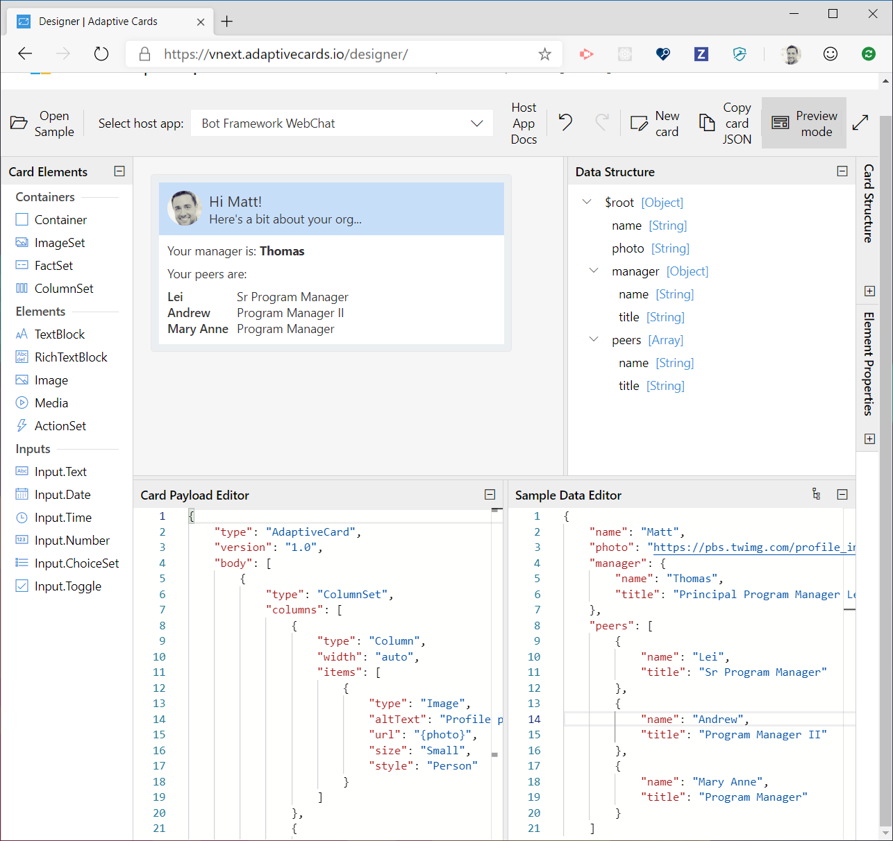

# Adaptive Cards Templating (Preview)

We're excited to share an early preview of new tools that will help you create, reuse, and share Adaptive Cards. 

> [!IMPORTANT] 
> 
> These features are **in preview and subject to change**. Your feedback is not only welcome, but  critical to ensure we deliver the features **you** need.

## How does templating help you?

Templating enables the separation of **data** from the **presentation** in an Adaptive Card. 

### It helps design a card that can be populated with real data

Today to populate an Adaptive Card with real data you have three options:

* Build a JSON string programatically using your language of choice
* Use our .NET or JavaScript object models to create an object representation of the card and then serialize to JSON
* Come up with your own method, like RazorLight, or a light-weight string-replace function

There are trade-offs with any of the above methods, but a key downside is that it becomes impossible to create a card using the [Adaptive Card Designer](https://adaptivecards.io/designer), then populate that card with real data, and then later put it back into the designer to make changes. 

Designer -> Backend Implementation is pretty much a one-way, one-time operation today.

The tools below hope to address this situation and make designing a card in the designer, then populating it with real data on any backend, and then putting it make into the designer to make tweaks work seamlessly.

### It helps 

### It opens possibilities where AI services can "reason" over the cards and enhance user productivity 


### By making the template a first-class object that can be passed around, you can start composing templates together 

### It helps you get a great looking card just from the data you provide

# What is Adaptive Cards Templating?

At it's core, templating enables the separation of **data** from **presentation** in your Adaptive Cards. And once you have that, a whole new world of possibilities opens up. 

It's comprised of 3 major components:

1. The **[Template Language](template-language.md)** is the syntax used for authoring a template. The Designer aids in authoring templates by offering a way to preview the template with sample data.
2. The **[Templating SDK's](sdk.md)** will exist on all supported Adaptive Card platforms. These SDKs allow you to populate a template with data, on the back-end or directly on the client. 
3. The **[Template Service](template-service.md)** is a proof-of-concept service that allows anyone to find, contribute to, and share a set of well-known templates.

## Template Language

The template langauge is the syntax used to author an Adaptive Card template. 



> [!NOTE]
> 
> Follow along with the example below by opening up a new tab to
>
> **http://vnext.adaptivecards.io/designer**
> 
> Click the **Preview Mode** button to toggle between design-mode and preview-mode.

The vNext Designer adds support for authoring templates and providing **Sample Data** to preview the template at design-time.

Paste the example below in the **Card Payload Editor** pane: 

**EmployeeCardTemplate.json**

```json
{
    "type": "AdaptiveCard",
    "version": "1.0",
    "body": [
        {
            "type": "ColumnSet",
            "style": "accent",
            "bleed": true,
            "columns": [
                {
                    "type": "Column",
                    "width": "auto",
                    "items": [
                        {
                            "type": "Image",
                            "url": "{photo}",
                            "altText": "Profile picture",
                            "size": "Small",
                            "style": "Person"
                        }
                    ]
                },
                {
                    "type": "Column",
                    "width": "stretch",
                    "items": [
                        {
                            "type": "TextBlock",
                            "text": "Hi {name}!",
                            "size": "Medium"
                        },
                        {
                            "type": "TextBlock",
                            "text": "Here's a bit about your org...",
                            "spacing": "None"
                        }
                    ]
                }
            ]
        },
        {
            "type": "TextBlock",
            "text": "Your manager is: **{manager.name}**"
        },
        {
            "type": "TextBlock",
            "text": "Your peers are:"
        },
        {
            "type": "FactSet",
            "facts": [
                {
                    "$data": "{peers}",
                    "title": "{name}",
                    "value": "{title}"
                }
            ]
        }
    ]
}
```

Then paste the JSON data below into the **Sample Data Editor**:

**Data**

```json
{
    "name": "Matt",
    "photo": "https://pbs.twimg.com/profile_images/3647943215/d7f12830b3c17a5a9e4afcc370e3a37e_400x400.jpeg",
    "manager": {
        "name": "Thomas",
        "title": "Principal Program Manager Lead"
    },
    "peers": [
        {
            "name": "Lei",
            "title": "Sr Program Manager"
        },
        {
            "name": "Andrew",
            "title": "Program Manager II"
        },
        {
            "name": "Mary Anne",
            "title": "Program Manager"
        }
    ]
}
```
 
* **Sample Data Editor** - Specify sample data here to view the data-bound card when in "Preview Mode." There is a small button in this pane to populate the Data Structure from the existing sample data.
* **Data Structure** - This is the structure of your sample data. Fields can be dragged onto the design surface to create a binding to them 
* **Preview Mode** - Press the toolbar button to toggle between the edit-experience and the sample-data-preview experience


> Learn more about the [template language](template-language.md)

## SDK support

During the initial preview we only have a limited set of SDKs available. When we release there will be templating libraries for every supported Adaptive Cards platform.

Platform | Install | Documentation
--- | --- | ---
JavaScript | `npm install adaptivecards-templating` | [Documentation](https://www.npmjs.com/package/adaptivecards-templating)
.NET | *coming soon* | *coming soon*

### JavaScript Example

The JavaScript below shows the general pattern that will be used to populate a template with data.

```js
var template = new ACData.Template({ 
    /* EmployeeCardTemplate goes here */ 
});

var dataContext = new ACData.EvaluationContext();
dataContext.$root = {
    /* Data goes here */
};

var card = template.expand(dataContext);
```

> Learn more [about the templating SDKs](sdk.md)

## Template Service

The Adaptive Cards Template Service is a proof-of-concept service that allows anyone to find, contribute to, and share a set of well-known templates.

It's useful if you want to display some data but don't want to bother writing a custom adaptive card for it.

> Learn more about the [card template Service](template-service.md)


# What's next and sending feedback

Templating and the separation of card presentation from data takes us a whole lot closer toward our mission of "an ecosystem of exchangeable card content in a common and consistent way".

We're eager to share more as soon as we can. In the meantime please give feedback here or Twitter **[@MattHidinger](https://twitter.com/matthidinger)**/**#AdaptiveCards**. 
