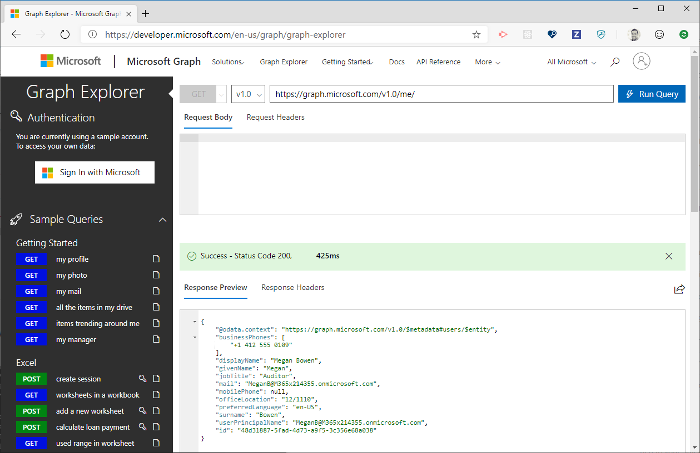

# Adaptive Card Template Service

The Adaptive Cards Template Service is a proof-of-concept service that allows anyone to find, contribute to, and share a set of well-known templates.

It's useful if you want to display some data but don't want to bother writing a custom adaptive card for it.

> Please read this for an [Overview of Adaptive Card Templating](index.md)

> [!IMPORTANT] 
> 
> *Terms and agreement* 
> 
> This **alpha-level** service is provided "as-is", with all faults and is not supported in any way. Any data collection from the service is subject to the [Microsoft privacy statement](https://go.microsoft.com/fwlink/?LinkID=824704).
> 
> These features are **in preview and subject to change**. Your feedback is not only welcome, but  critical to ensure we deliver the features **you** need.

## How does the service help me?

Let's say I just got a piece of data, maybe it's stock/financial data, healthcare data, Microsoft Graph data, or schema.org data. 

Now I want to display this data to a user. 

Traditionally that means writing a UI template in whatever 

 I don't have a standard way to display it. The template service helps you discover templates for various types of data, retrieve an Adaptive Card template for the data, or populate the template with data server-side, so you can deliver an Adaptive Card to any [supported platform](https://docs.microsoft.com/en-us/adaptive-cards/resources/partners).

* An HTTP endpoint for **finding**
* A shared, open-source template repository backed by GitHub.
* All the templates are flat JSON files in the repo which makes editing, contributing, and sharing painless.
* The code for the service will be made available so you can host it on your own; not everyone has to go through `https://templates.adaptivecards.io` to get the functionality this service provides.


## Using the service

### Get all templates 

This endpoint returns a list of all known templates.

> `HTTP GET https://templates.adaptivecards.io/list`

**Response excerpt**

```json
{
  "graph.microsoft.com": {
    "templates": [
      {
        "file": "Files.json",
        "fullPath": "graph.microsoft.com/Files.json"
      },
      {
        "file": "Profile.json",
        "fullPath": "graph.microsoft.com/Profile.json"
      }
   ]
}
```

### Find a template

This endpoint tries to find a template by analyzing the structure of your data.

> `HTTP POST https://templates.adaptivecards.io/find`

#### Example

Let's say I just hit a [Microsoft Graph](https://graph.microsoft.com) endpoint to get organizational data about me.

> `HTTP GET https://graph.microsoft.com/v1.0/me/`



That API returned some JSON data, but how do I display it using Adaptive Cards? First I want to see if a template exists for this type of data, so I make an HTTP request to the `/find` endpoint with my data in the `POST body`.

```
HTTP POST https://templates.adaptivecards.io/find

Body:
{
    "@odata.context": "https://graph.microsoft.com/v1.0/$metadata#users/$entity",
    "businessPhones": [
        "+1 412 555 0109"
    ],
    "displayName": "Megan Bowen",
    "givenName": "Megan",
    "jobTitle": "Auditor",
    "mail": "MeganB@M365x214355.onmicrosoft.com",
    "mobilePhone": null,
    "officeLocation": "12/1110",
    "preferredLanguage": "en-US",
    "surname": "Bowen",
    "userPrincipalName": "MeganB@M365x214355.onmicrosoft.com",
    "id": "48d31887-5fad-4d73-a9f5-3c356e68a038"
}
```

**Response:**

```json
[
  {
    "templateUrl": "graph.microsoft.com/Profile.json",
    "confidence": 1
  }
]
```

The service returns a list of any matching templates, along with a `confidence` indicating how close the match is. Now I can use that template URL to get the template, or populate it server-side.

### Get a template

A template retrieved from this endpoint can be populated with data at runtime [using the templatng SDKs](sdk.md).

> `HTTP GET https://templates.adaptivecards.io/[TEMPLATE-PATH]`

You can also include "sample data" with the template, which makes editing in the designer more friendly:

> `HTTP GET https://templates.adaptivecards.io/[TEMPLATE-PATH]?sampleData=true`

#### Example

Let's get the Microsoft Graph profile template that was returned from `/find` above.

`HTTP GET https://templates.adaptivecards.io/graph.microsoft.com/Profile.json`

**Response excerpt**

```json
{
  "type": "AdaptiveCard",
  "version": "1.0",
  "body": [
    {
      "type": "TextBlock",
      "size": "Medium",
      "weight": "Bolder",
      "text": "{name}"
    },
    {
        // ...snip
    }
  ]
}
```

### Populate a template server-side

In some cases it may not make sense to populate a template on the client.  For these use cases, you can have server return a fully-populated Adaptive Card that can be passed to any Adaptive Card Renderer.

> `HTTP POST https://templates.adaptivecards.io/[TEMPLATE-PATH]`

#### Example

Let's populate the Microsoft Graph profile template that was returned from `/find` using the data above.

```
HTTP POST https://templates.adaptivecards.io/graph.microsoft.com/Profile.json

Body:
{
    "@odata.context": "https://graph.microsoft.com/v1.0/$metadata#users/$entity",
    "businessPhones": [
        "+1 412 555 0109"
    ],
    "displayName": "Megan Bowen",
    "givenName": "Megan",
    "jobTitle": "Auditor",
    "mail": "MeganB@M365x214355.onmicrosoft.com",
    "mobilePhone": null,
    "officeLocation": "12/1110",
    "preferredLanguage": "en-US",
    "surname": "Bowen",
    "userPrincipalName": "MeganB@M365x214355.onmicrosoft.com",
    "id": "48d31887-5fad-4d73-a9f5-3c356e68a038"
}
```

**Response excerpt**

```json
{
  "type": "AdaptiveCard",
  "version": "1.0",
  "body": [
    {
      "type": "TextBlock",
      "size": "Medium",
      "weight": "Bolder",
      "text": "Megan Bowen"
    },
    {
        // ...snip
    }
  ]
}
```

## Contributing templates

The template service is backed by a private GitHub repo currently, but we will open source it shortly.

Our hope is that by using GitHub as a backing store for the templates, we can "democratize" the process of authoring, improving, and sharing templates. Anyone can submit a Pull Request that includes a whole new template, or make enhancements to existing ones... all within the developer-friendly experience of GitHub.

## Self-hosting the service

Not all types of data are appropriate for the "central" Adaptive Cards template service hosted at `https://templates.adaptivecards.io`. 

We want to make sure anyone can host the template service within your organization, so the source code will be made available and we'll make it very simple to deploy to Azure or your own back-end.

More on this at a later date.